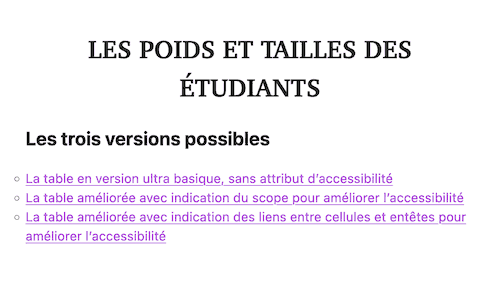
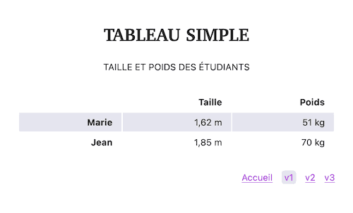

# html-table-base

> HTML exercise about HTML tables

* * *

**html-table-base** is an educational project, which will be used for HTML courses.

**Note:** the school where the course is given, the [HEPL](http://www.hepl.be) from Liège, Belgium, is a french-speaking school. From this point, the instruction will be in French. Sorry.

* * *

## Exercice de base sur les tables HTML

Cet exercice crée un premier petit tableau simple de base qui présente la taille et le poids de deux étudiants.

Pour naviguer entre ces trois fichiers, veuillez créer à la racine de ce projet un fichier nommé `index.html`

### Version 1

Créez le fichier `index1.html` avec les bonnes balises afin d’arriver au résultat suivant :

Passez votre code au validateur (TotalValidator). Qu’obtenez-vous comme avertissement WCAG ? Pourquoi ?

### Version 2

Créez le fichier `index2.html` en ajoutant l’attribut `scope` sur les cellules de titre.

Repassez votre code au validateur (TotalValidator) et vérifiez que vos cellules de titre et de données sont correctement liées (l’avertissement WCAG a disparu).

### Version 3 (alternative)

Créez le fichier `index3.html` en ajoutant des attributs `id` sur les cellules de titre et des attributs `headers` sur les cellules de données.

Passez votre code au validateur (TotalValidator) et vérifiez que vous n’avez ni erreur de validation, ni avertissement WCAG.